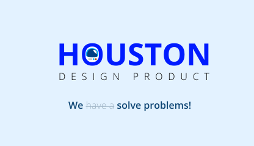

# Houston Design Product

 

## Tech stack
Building components
- 📚 [Storybook](https://Storybook.js.org) for UI component development and [auto-generated docs](https://medium.com/Storybookjs/Storybook-docs-sneak-peak-5be78445094a)
- 💅 [Styled-components](https://www.styled-components.com/) for component-scoped styling
- ⚛️ [React](https://reactjs.org/) declarative component-centric UI

Maintaining the system
- 📦 [NPM](https://www.npmjs.com/) for [packaging and distribution](https://blog.hichroma.com/how-packaging-makes-it-dead-simple-to-share-ui-components-29912593539d)
- ✅ [Chromatic](https://www.chromatic.com/) to prevent UI bugs in components (by Eduzz maintainers)
- 🚥 [CircleCI](https://circleci.com/) Continuous integration
